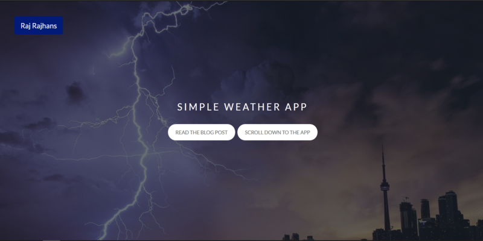
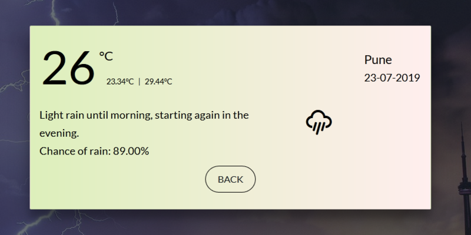

# Simple Weather App

This project started as a command line application, which then evolved into a simple Flask WebApp. The app has been deployed at https://weather.rajrajhans.com/

## Blog Post 

To know more about this project, please read the blog post accompanying it - [ Weather WebApp following MVC pattern](https://rajrajhans.com/weather-webapp/).

## Screenshots

<em>Image: Homepage of the WebApp</em>

<em>Image: Weather card for Pune City</em>

## Running the project

This project was created with [Flask](https://palletsprojects.com/p/flask/).

In the project directory, you can run:

#### `pip install -r requirements.txt`
which installs all the necessary dependencies.

#### `python app.py`
Runs the app in the development mode. 
Open [http://localhost:5000](http://localhost:3000) to view it in the browser.

## Reflection
This was a 3 week long project built during my summer vacation as a freshman. Project goals included using technologies learned up until this point and familiarizing myself with the MVC design pattern for developing software and using APIs in Python.  

Initially, this project started as a command line based program that took input from the user and showed the weather on command line itself. It then evolved as a WebApp built using Flask and following the MVC pattern. 

One of the main challenges I faced was the timeout error that was raised because of the usage limits of Nominatim, which is a free geocoding API by OpenStreetMaps. I solved this problem by writing a recursive function that called itself after a sleep period of 1 second if there was a timeout error due to Nominatim.

I also faced some inconvenience organizing the code files during developing the front-end of the application as I used plain HTML and CSS. I intend to improve this by using React for the front-end to make the development process more seamless and easy to change and reuse. 
